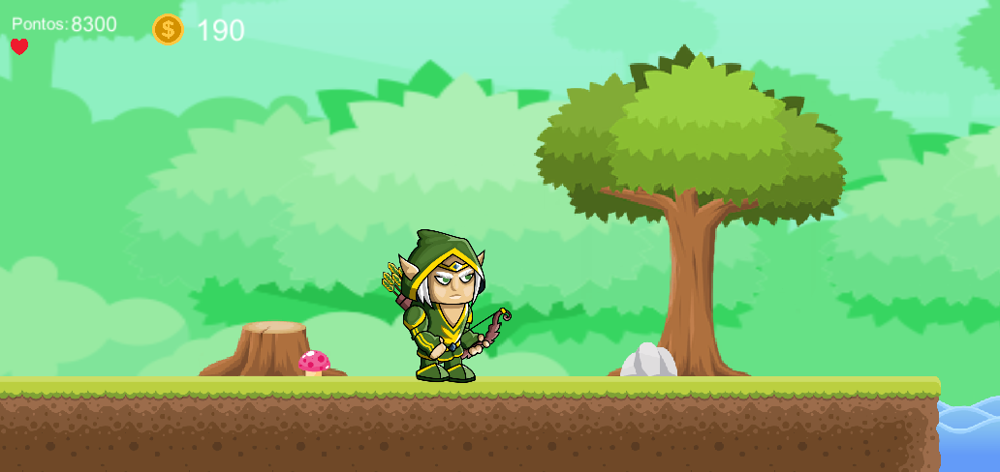

	
    <h3>Arqueiro das Palavras</h3>

    
Conteúdo

    <ul>
        <li><a href="#introdução">Introdução</a></li>
        <li><a href="#desenvolvimento">Desenvolvimento</a></li>
        <li><a href="#apresentação-do-jogo">Apresentação do Jogo</a></li>
        <li><a href="#fases-do-projeto">Fases do Projeto</a></li>
        <li><a href="#atualmente">Atualmente</a></li>
    </ul>

## Introdução

Arqueiro das Palavras era um projeto educativo que desenvolvi em conjunto com duas professoras do Ensino Médio. O objetivo do projeto era de gameficar o aprendizado, com desafio do jogo de plataforma e "chefes" da matéria que estiver estudando.

## Desenvolvimento

* O jogo em 2D - Plataforma foi desenvolvido na `Engine Unity`, inteiramente em `C#`, com referências em jogos de plataforma, mas principalmente em Super Mario.
* Todas as imagens e vetores foram retiradas de sites, ferramentas e plugins gratuitos, e editados e/ou criados por mim.
* Utilizei a ferramenta `DragonBones` para fazer animação bruta do personagem.
* Utilizei o plugin `TextMesh Pro` para criar o mapa de plataforma.
* E utilizei o `Photoshop` para as edições, colagens, recortes e Frames.
* Para animação dentro jogo utilizei o animator do `Unity`. 

## Apresentação do jogo

A ideia principal do jogo é o aluno se desafiar a passar de fase, destruindo obstáculos e matando os inimigos. E em determinados pontos de salvamento, responder uma pergunta associada a matéria que estiver estudando. Quanto mais inimigos derrotados, obstáculos destruidos e respostas corretas, mais pontos terá no final da fase. Com a pontuação, cria uma competitividade com os colegas, impulsionando a jogar mais e por consequencia, fixar ainda mais o conteúdo da matéria.

    
    

A cada resposta correta, o aluno recebe um fragmento que será utilizado para montar seu mapa mental dentro do jogo. O mapa mental é feito por associação do termo com conceito do termo, e o aluno deve arrastar o fragmento recebido para o conceito relacionado.

    

    

## Fases do projeto

1. A primeira fase do projeto seria o desenvolvimento do piloto, com 3 fases jogáveis, 4 perguntas em cada fase (3 pontos de salvamento e 1 concluindo a fase) e o mapa mental de aprendizagem dessas 3 fases montada pelo jogador. Além da Mentoruja, uma assistente ao aluno que o ajudará nas perguntas que empacar.  
Este piloto seria conteúdo de reforço para o 6º ano, neste caso, para Lingua Portuguesa, e o conteúdo referente aos Tipos de Sujeito.

2. A segunda fase seria o desenvolvimento de uma ferramenta de acesso aos professores para desenvolverem e colocar dentro do jogo as perguntas e respostas, e quais termos e conceitos devem ser colocados no mapa mental. Dessa forma abrangeria para outras matérias.  
Além disso, essa ferramenta traria um feedback de quais perguntas os alunos tiveram mais dificuldade, indicando a quantidade de erros, acertos e tentativas.

3. A fase de criação dos outros mundos. A terceira fase seria o avanço de conteúdo para os outros anos do ensino fundamental, sendo cada ano, um mundo dentro do jogo, com ambientes e inimigos diferentes.

4. A última que planejamos, tornar o jogo online, mas com turmas administradas por professores. Como se o professor criasse uma sala no jogo, e distribuisse para os alunos de uma determinada turma. Mas a pontuação ficar salva ao personagem do aluno.  
Essa fase é marcada também com a customização do personagem e criação de usuário para cada aluno que tiver acesso ao jogo.

## Atualmente

O desenvolvimento do projeto foi pausado por tempo indeterminado, mas existe uma versão jogável da primeira fase. Pode ser baixado e descompactado [aqui](https://drive.google.com/file/d/1ZBGh-KaktvRAtsfX10IyCFHAZFBHUm2h/view?usp=share_link).  

Caso não lembre da matéria de LP (como eu), segue as respostas: 
1. Pergaminho: **simples** / **oculto** 
2. Pergaminho: **simples** / **simples** 
3. Pergaminho: **composto**
